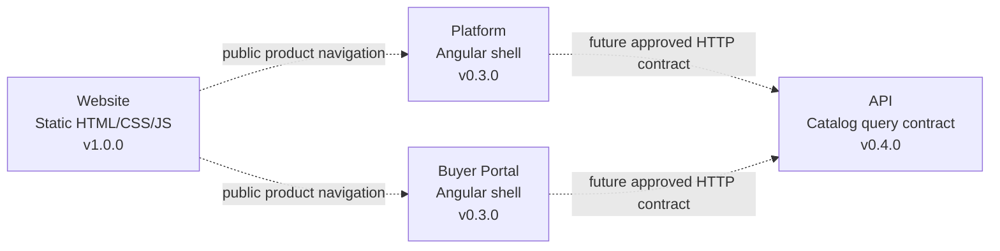
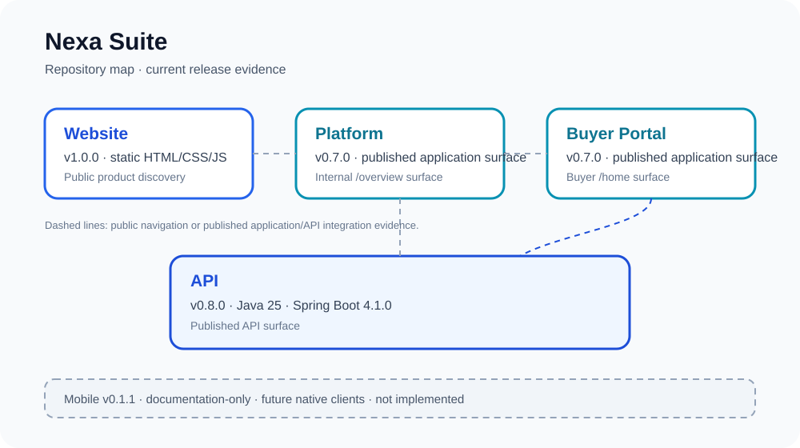

<div align="center">

<br/>


<br/><br/>

# Nexa Website

**Public static website and product entry point for the Nexa B2B cold-chain platform.**


[Changelog](./CHANGELOG.md) · [Release notes](./docs/releases/) · [Contributing](./.github/CONTRIBUTING.md) · [Security](./.github/SECURITY.md)

**Current repository:** Website · **Current release:** `v1.0.0`

[API](https://github.com/nexa-suite/api) · [Platform](https://github.com/nexa-suite/platform) · [Portal](https://github.com/nexa-suite/portal) · [Mobile](https://github.com/nexa-suite/mobile)

</div>

---

## Scope and evidence

This repository contains the functional public site: static HTML pages, CSS design layers, vanilla JavaScript interactions and ES/EN content. `v1.0.0` preserves that source and adds only repository governance, release documentation and a suite map.

The website does not implement a backend, database, AI, IoT, mobile client or external cloud integration. Links carrying `data-webapp-path` are navigation targets in the public copy and are not runtime proof of an available WebApp service.

## Product boundaries



The dotted links describe product boundaries and future approved contracts, not deployed integration. Mobile is not implemented and is intentionally absent from the runtime map. PostgreSQL, AI, IoT and cloud services are not implemented in this website release.



## Repository map

| Repository | Current release | Responsibility | Evidence status |
|---|---:|---|---|
| **Website** | **`v1.0.0`** | Public product discovery | Functional static site |
| [Platform](https://github.com/nexa-suite/platform) | `v0.3.0` | Internal operations shell | Angular shell |
| [Portal](https://github.com/nexa-suite/portal) | `v0.3.0` | Buyer self-service shell | Angular shell |
| [API](https://github.com/nexa-suite/api) | `v0.4.0` | Business and integration authority | Catalog query contract |
| [Mobile](https://github.com/nexa-suite/mobile) | `v0.1.1` | Future native clients | Documentation-only |

## Pages

| Path | Purpose |
|---|---|
| [`index.html`](./index.html) | Product overview and calls to action |
| [`pages/platform.html`](./pages/platform.html) | Platform capabilities and operational context |
| [`pages/buyer-portal.html`](./pages/buyer-portal.html) | Buyer-facing product context |
| [`pages/about-the-product.html`](./pages/about-the-product.html) | Product and workflow detail |
| [`pages/about-the-team.html`](./pages/about-the-team.html) | Team information |
| [`pages/company.html`](./pages/company.html) | Company and contact information |
| [`pages/pricing.html`](./pages/pricing.html) | Pricing presentation and contact flow |
| [`pages/faq.html`](./pages/faq.html) | Frequently asked questions |
| [`pages/solutions/`](./pages/solutions/) | Importer, distributor and cold-storage pages |
| [`pages/legal/`](./pages/legal/) | Terms, privacy and cookies |

## Tech stack

| Layer | Technology |
|---|---|
| Markup | HTML5 |
| Styling | CSS3 with tokens and responsive layout |
| Interactivity | Vanilla JavaScript |
| Internationalization | Custom ES/EN dictionaries |
| Local hosting | Python static server, Docker/nginx or the declared static host configuration |

No package manager or dependency installation is required for the website.

## Getting started

```bash
python3 -m http.server 8000
```

Open [http://localhost:8000](http://localhost:8000). The site can also be served by the existing [Dockerfile](./Dockerfile); `render.yaml` describes static hosting configuration but is not deployment evidence.

## Validation

```bash
node --check assets/js/i18n.js
node --check assets/js/interactions.js
node --check assets/js/animations.js
node --check assets/js/pricing.js
```

For visual work, serve the site locally and inspect desktop and mobile layouts in a browser. This documentation update does not rework functional HTML, CSS or JavaScript.

## Project structure

```text
assets/css/                           # Design tokens and page styles
assets/img/                           # Local logos, illustrations and product imagery
assets/js/                            # i18n, interactions, animations and pricing behavior
pages/                                # Product, solution and legal pages
docs/assets/repository-map/           # Local architecture map
docs/releases/                        # Product and documentation release notes
.github/                              # Community guidance and validation workflows
```

## Documentation

- [Release notes v1.0.0](./docs/releases/v1.0.0.md)
- [Release notes index](./docs/releases/)
- [Changelog](./CHANGELOG.md)
- [Release policy](./.github/RELEASE_POLICY.md)

## Claim boundary

Marketing content may describe future Nexa capabilities, but only content explicitly marked as available is treated as current evidence. No page in this repository proves API integration, persistence, tenant authorization, GPS, IoT telemetry, payment processing, AI or mobile execution.
